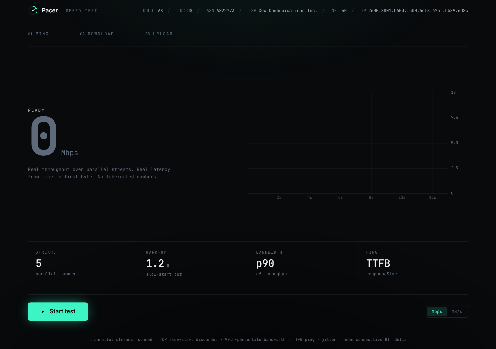
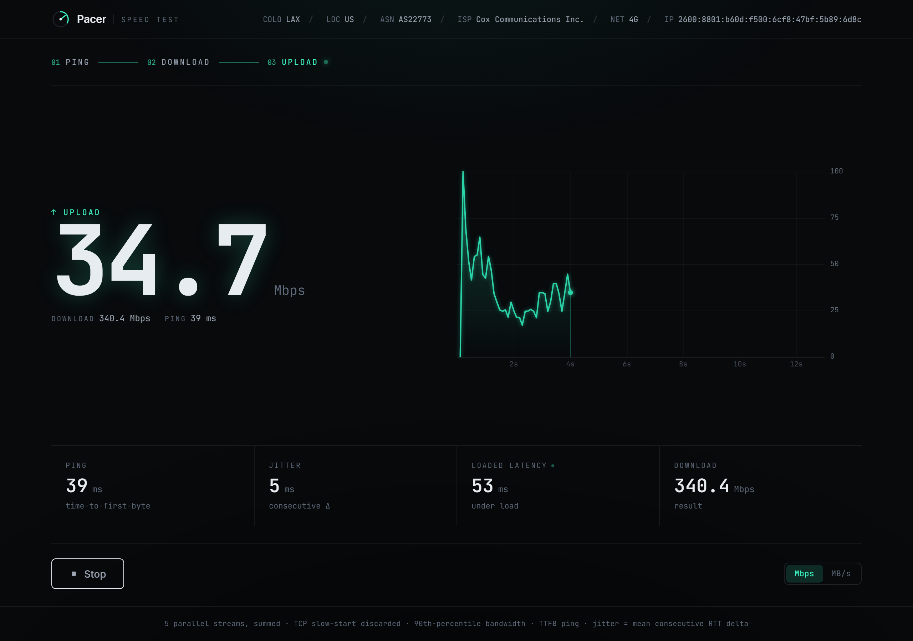
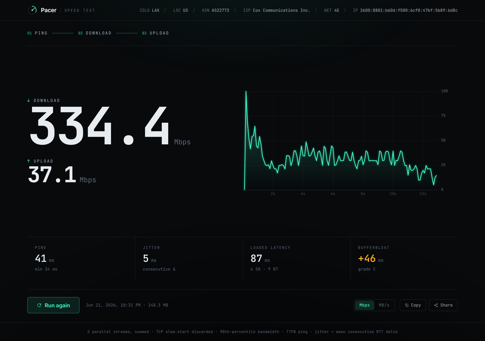
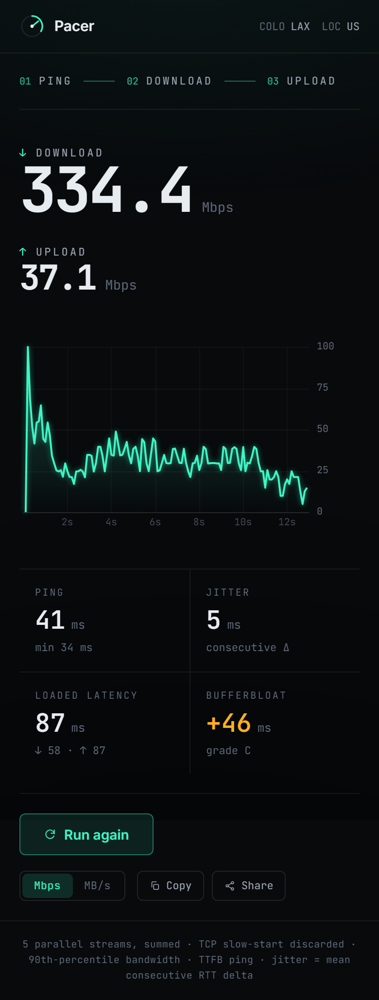

# Pacer

**A precision internet speed test, built from scratch.** Every byte of measurement
logic — the throughput engine, the percentile math, the latency probing, and the
backend that serves the test bytes — is hand-written. No `@cloudflare/speedtest`,
no LibreSpeed, no third-party measurement endpoints.

🔗 **Live demo:** https://simdexapp.github.io/pacer/

| Idle | Live (download) | Results |
| --- | --- | --- |
|  |  |  |

<p align="center"></p>

---

## Why this exists

Most "speed test in 200 lines" demos quietly under-report by 2–5×. They use a single
connection (which can't saturate a fast link), they include TCP slow-start in the
average, they measure latency with `Date.now()`, and they upload a buffer of zeros
that the network compresses into a fake-fast result. Pacer does the boring,
correct thing in every one of those places — and shows its work in a calm,
instrument-cluster UI.

## Architecture

Three owned pieces, each independently portable:

| Layer | What it is | Where |
| --- | --- | --- |
| **Frontend** | Vite + React + TypeScript + Tailwind, deployed to GitHub Pages | [`src/`](src/) |
| **Engine** | A standalone, framework-agnostic measurement module | [`src/engine/`](src/engine/) |
| **Backend** | One Cloudflare Worker that streams/drains test bytes | [`worker/`](worker/) |

The frontend reads the backend location from a **single config constant**
([`src/config.ts`](src/config.ts) → `WORKER_BASE_URL`, overridable with the
`VITE_WORKER_URL` env var). The Worker is host-agnostic in spirit: the only
Cloudflare-specific parts are `request.cf` (for `/meta`) and `wrangler deploy`. A
Deno or Node port is a couple of lines — the streaming and draining are standard
Web Streams.

## Methodology (in plain language)

This is the part that matters. Here is exactly what Pacer measures and why.

### Ping & jitter
About 20 sequential `GET /down?bytes=0` requests. Round-trip time is taken from
**`PerformanceResourceTiming.responseStart`** — the browser's own record of when the
first response byte arrived, i.e. true time-to-first-byte — not a `Date.now()` guess.
(This only works because the Worker sends `Timing-Allow-Origin: *`; without it a
cross-origin browser zeroes those timestamps out, so we fall back to a
`performance.now()` delta around an empty response.) We report **min** and **median**
ping, and **jitter = the mean absolute difference between consecutive RTTs** — the
sample-to-sample wobble that actually degrades calls and games, not the spread around
the average.

### Download
4–6 **parallel** `fetch()` streams, each read chunk-by-chunk with
`response.body.getReader()`. A single TCP connection can't fill a fast pipe, so we open
several and **sum** their byte rates — this is the number-one reason naive tests
under-report. The first ~1.2 s of samples (TCP **slow-start**) are **discarded**.
Request size **adapts** to the measured speed so each request lasts ~1.5 s. The
headline number is the **90th percentile** of the post-warmup instantaneous-throughput
samples: a saturated link spends most of its time near its true ceiling, and p90
captures that ceiling while ignoring the warmup ramp and transient dips. Each phase is
capped at ~13 s and ~100 MB.

### Upload
The same shape, but with **`XMLHttpRequest`** instead of `fetch` — because `fetch`
exposes no upload progress, and `xhr.upload.onprogress` is the only way to get
loaded-bytes-over-time for the live chart. The payload is **incompressible random
data** from `crypto.getRandomValues()` (which caps at 65536 bytes per call, so we fill
a buffer in a loop). **Never zeros** — a CDN would gzip those away and report a wildly
inflated upload speed.

### Loaded latency / bufferbloat
While each transfer is saturating the link, Pacer keeps pinging. The **median loaded
RTT minus the idle median** is the bufferbloat figure — how much your latency balloons
under load — graded A–F.

### Units
Everything is computed in **megabits per second**: `bytes × 8 / seconds / 1e6` (decimal
mega, the convention ISPs advertise). A **MB/s** toggle divides by 8. Bits-vs-bytes is
the most common bug in the category; Pacer gets it right in exactly one place
([`src/engine/stats.ts`](src/engine/stats.ts)) and converts for display only.

## The engine API

The engine knows nothing about React. Drop it into anything:

```ts
import { SpeedTestEngine } from "./engine/speedtest";

const engine = new SpeedTestEngine(
  { baseUrl: "https://pacer-speedtest.example.workers.dev" },
  {
    onPhaseChange: (phase) => console.log(phase),
    onProgress: (e) => console.log(e.mbps),
    onComplete: (result) => console.log(result.download?.mbps),
    onError: (err) => console.error(err),
  },
);

engine.start();        // returns a Promise<SpeedTestResult | null>
// engine.cancel();    // AbortController-based, stops cleanly mid-run
```

## Running locally

```bash
npm install
npm run dev            # Vite dev server
```

By default the dev frontend talks to the already-deployed Worker. To run the whole
stack locally:

```bash
npm run worker:dev     # wrangler dev on http://localhost:8787
# then set VITE_WORKER_URL=http://localhost:8787 (e.g. in a .env file)
npm run dev
```

Type-check and production build:

```bash
npm run build          # tsc -b && vite build
```

## Deploying the Worker

```bash
npx wrangler deploy --config worker/wrangler.toml
```

Wrangler prints the public URL (e.g. `https://pacer-speedtest.<subdomain>.workers.dev`).
Paste it into [`src/config.ts`](src/config.ts) (`WORKER_BASE_URL`) or set `VITE_WORKER_URL`.

**Worker routes**

| Route | Behavior |
| --- | --- |
| `GET /down?bytes=N` | Streams N bytes (≤100 MB) of fresh random data via a `ReadableStream`. |
| `POST /up` | Drains and discards the body; returns `{ bytes }`. |
| `GET /meta` | `{ ip, isp, asn, colo, country }` from `request.cf` + `CF-Connecting-IP`. |
| `OPTIONS *` | CORS preflight. |

All responses send `Access-Control-Allow-Origin: *`, `Cache-Control: no-store`, and
`Timing-Allow-Origin: *`.

## Deploying the frontend (GitHub Pages)

Pushing to `main` triggers [`.github/workflows/deploy.yml`](.github/workflows/deploy.yml),
which builds and publishes `dist/` to GitHub Pages. **One-time setup:** in the repo,
go to **Settings → Pages → Build and deployment → Source** and select **GitHub Actions**.

Because the site is served from `https://<user>.github.io/pacer/`, Vite's `base` is set
to `/pacer/` ([`vite.config.ts`](vite.config.ts)). Fork under a different name → change
`base` to match.

## License

MIT — see [LICENSE](LICENSE).
